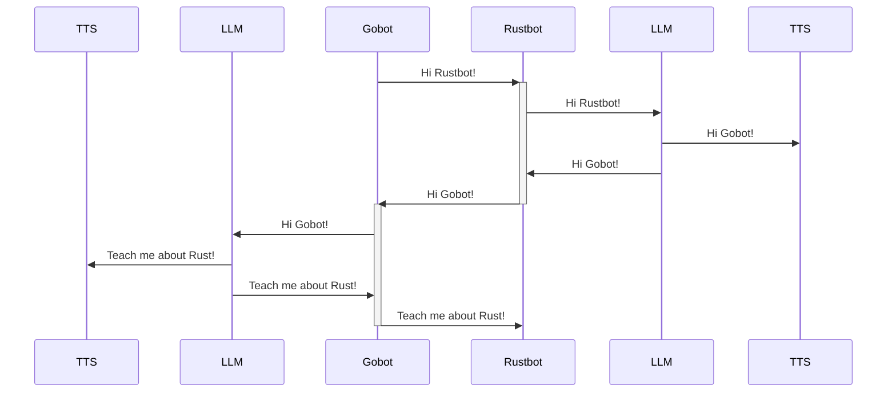
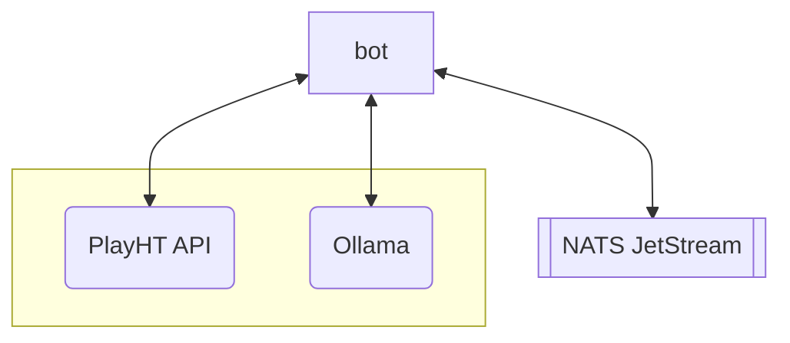
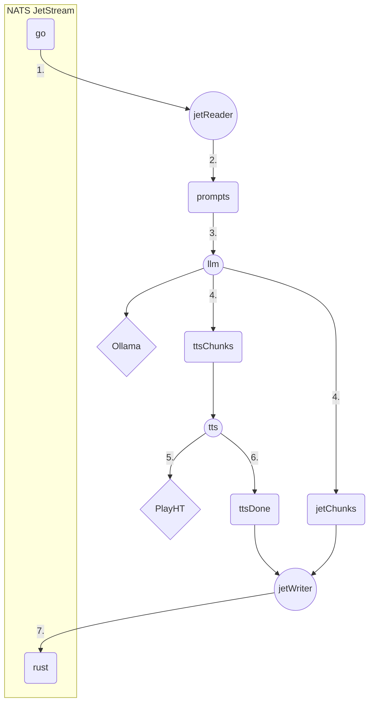

# bot-banter

This is a PoC demonstrating how two bots can autonomously "speak" to each other using an [LLM](https://en.wikipedia.org/wiki/Large_language_model) and [TTS](https://simple.wikipedia.org/wiki/Text_to_speech).
It uses [NATS jetstream](https://docs.nats.io/nats-concepts/jetstream) for message routing, [ollama](https://ollama.com/) for generating text using an LLM of the user's choice and [playht](https://play.ht) API for TTS speech synthesis.

[](https://github.com/milosgajdos/bot-banter/actions?query=workflow%3ACI)
[](https://pkg.go.dev/github.com/milosgajdos/bot-banter)
[](https://opensource.org/licenses/Apache-2.0)

> [!IMPORTANT]
> This project was built purely for educational purposes and thus is likely ridden with bugs, inefficiencies, etc.
> You should consider this project as highly experimental.

## Bot Conversation Flow



## Architecture

Zoomed in view on the high-level architecture:



## Tasks, Goroutines, Channels

> [!NOTE]
> Mermaid does not have proper support for controlling layout or even basic graph legends
> There are some terrible workarounds, so I've opted not to use them in this README, hence
> the diagram might feel a bit unwieldy



1. `jet.Reader` receives a message published on a JetStream subject
2. `jet.Reader` sends this message to the `prompts` channel
3. `llm` worker reads the messages sent to the `prompts` channel and forwards them to ollama for LLM generation
4. ollama generates the response and the `llm` worker sends it to both `ttsChunks` and `jetChunks` channels
5. `tts` worker reads the message and sends the message to PlayHT API and streams the audio to the default audio device;
6.  once the playback has finished `tts` worker notifies `jet.Writer` via the `ttsDone` channel that it's done playing audio
6. `jet.Writer` receives the notification on the `ttsDone` channel and publishes the message it received on `jetChunks` channel
     to a JetStream subject

# HOWTO

There are a few prerequisites:
* [nats](https://nats.io/)
* [ollama](https://ollama.com/)
* Create an account on [playht](https://play.ht/)
* sound/audio libraries on some platforms e.g. Linux

## Run NATS

Both bots use [nats](https://nats.io/) as their communication channel.

### Homebrew

Install
```shell
brew tap nats-io/nats-tools
brew install nats nats-server
```

Run:
```shell
nats-server -js
```

### Nix

```shell
nix-shell -p nats-server natscli
nats-server -js
```

## Run Ollama

Download it from the [official site](https://ollama.com/) or see the Nix install below.

### Nix

```
nix-shell -p ollama
```

Run a model you decide to use
```shell
ollama run llama2
```

## Audio libraries

If you are running on Linux you need to install the following libraries -- assuming you want to play with the bot-speaking service

> [!NOTE]
> This is for Ubuntu Linux, other distros have likely different package names
```shell
sudo apt install -y --no-install-recommends libasound2-dev pkg-config
```

## playht API credentials

Once you've created an account on [playht](https://play.ht) you need to generate API keys.
See [here](https://docs.play.ht/reference/api-authentication) for more details.

Now, you need to export them via the following environment variables which are read by the client libraries we use ([go-playht](https://github.com/milosgajdos/go-playht), [playht_rs](https://github.com/milosgajdos/playht_rs)):
```shell
export PLAYHT_SECRET_KEY=XXXX
export PLAYHT_USER_ID=XXX
```

## Run the bots

> [!IMPORTANT]
> Once you've started `gobot` you need to prompt it.
> `gobot` reads prompt from `stdin` which kickstarts the conversation:
> `rusbot` waits for `gobot` before it responds!

Start the `gobot`:
```shell
go run ./gobot/...
```

Start the `rustbot`:
```shell
cargo run --manifest-path rustbot/Cargo.toml
```
